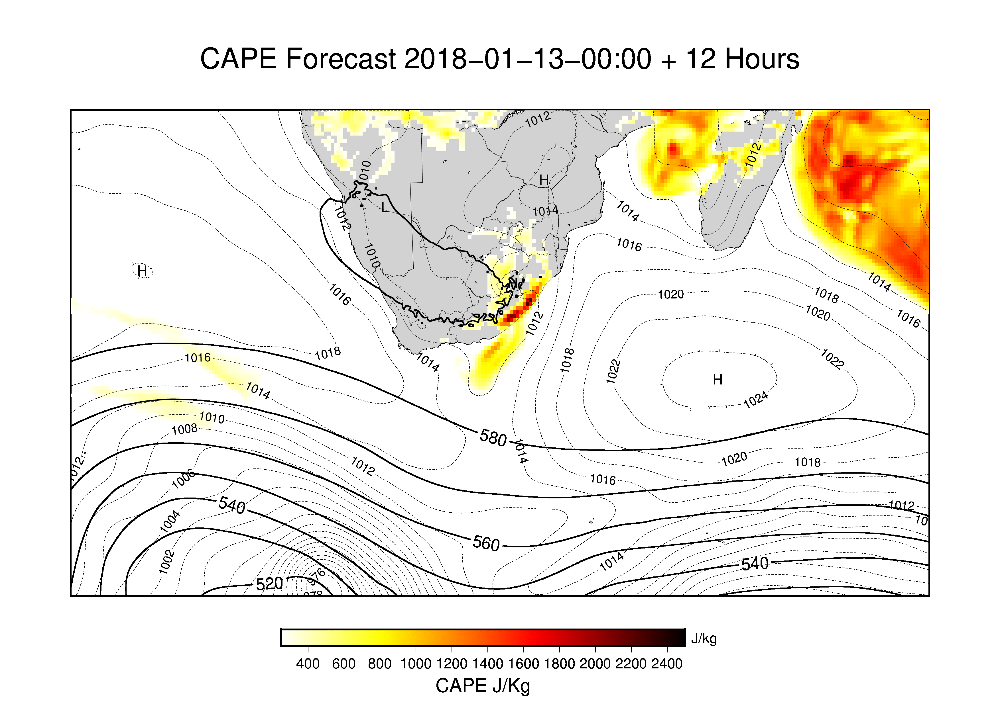
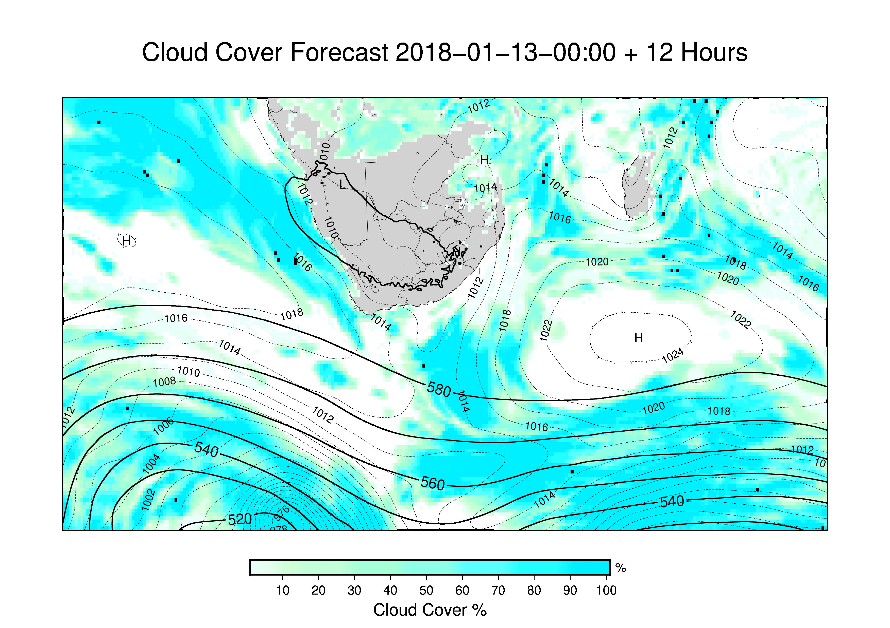

# README

#################################            
Henno Havenga
GMT 5.4.3             
wget 1.19.2            
CDO 1.9.2             
NCEP/NOAA https://goo.gl/xP3X4L   
SA Shapefile: Natural Earth   
MIT Licence            
#################################

######################################################################## 
 
DISCLAIMER:                                                          
This a simple program to make your own weather forecast using
publicly available Global Forecasting (GFS) data. The main programs
used include WGET to grab gfs data from the NCEP/NOAA server,
Climate Data Operators (CDO) to convert and modify the data where
needed and the main program used here is Generic Mapping Tools (GMT).
GMT is used to perform mathematical functions on the datasets and to
draw and plot the data over the desired area. All data and code is
free to use and share, however, respect the license terms and conditions.
                                                                     
Please be aware that this is NOT an official weather forecast.
The products created here should not be used in anyway or
form to issue any kind of weather alerts as the South-African Weather
Service (SAWS) is the only recognized authority in South-Africa
allowed to do so. It is not the authors job to argue the law. Instead
users are encouraged to use the products for education purposes.

########################################################################

# Examples

